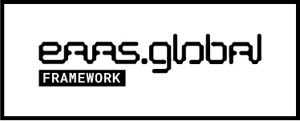
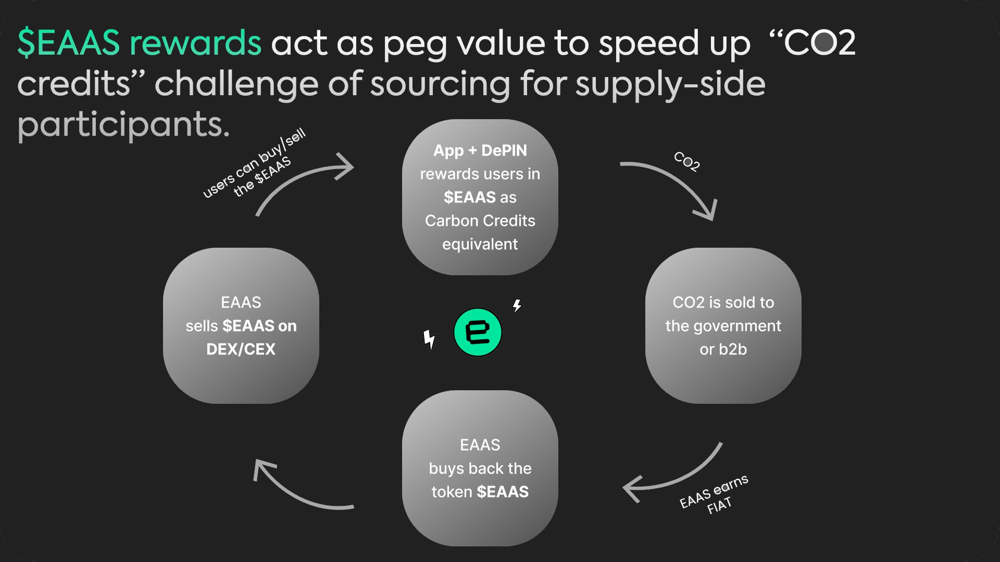

In today's world, where environmental concerns are paramount, EAAS introduces an innovative solution that intertwines technology, sustainability, and financial empowerment. Through our native mobile app and cutting-edge DePIN hardware, users are not only rewarded but also empowered to contribute to carbon offsetting efforts effortlessly.This comprehensive **framework** forms the backbone of EAAS, driving positive environmental change while offering financial incentives to users.

## Here is how it works:

App + DePIN: A Path to Carbon Neutrality
Users leveraging our native mobile app and DePIN hardware receive rewards in $EAAS RWA Token, equivalent to Carbon Credits. This dual-channel approach allows individuals to actively participate in the carbon credit economy while embracing sustainable practices in their daily lives.

CO2 Transaction: Streamlining Carbon Emissions Management
The carbon dioxide (CO2) generated by users is seamlessly sold to government bodies or B2B entities. This process ensures efficient carbon emissions management, wherein carbon credits are monetized to fund sustainable initiatives.

EAAS Earns FIAT: Bridging Sustainability and Financial Returns
As the intermediary in carbon credit transactions, EAAS earns fiat currency, thereby fostering sustainability while generating financial returns. This symbiotic relationship between environmental stewardship and economic viability is at the heart of our mission.

Token Transaction: Reinforcing Environmental Commitment
EAAS actively buys back $EAAS RWA tokens from the market, underscoring our unwavering commitment to supporting environmental initiatives. This practice not only ensures token liquidity but also demonstrates our dedication to sustainable development.

Token Exchange: Enhancing Accessibility and Liquidity
Subsequently, the $EAAS RWA Token is made available on both decentralized (DEX) and centralized (CEX) exchanges, enhancing accessibility and liquidity for investors and stakeholders alike. This facilitates seamless participation in the carbon credit economy and promotes widespread adoption of sustainable practices.

Through this circular framework, users seamlessly engage in buying and selling $EAAS RWA tokens, contributing to a sustainable ecosystem while actively participating in the carbon credit economy. At EAAS, we believe that technology can be a powerful catalyst for positive environmental change, and we invite you to join us on this transformative journey towards a greener future.