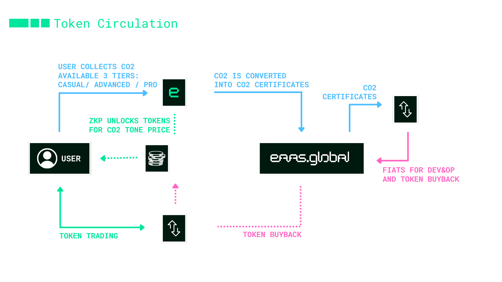

In today's world, where environmental concerns are paramount, EAAS introduces an innovative solution that intertwines technology, sustainability, and financial empowerment.

Our Framework monetises environmental CO2 data from App & Hardware (DePIN) using ZK Algorithm into tokenized digital assets reward in $DEPIN
 
Through our native mobile app and cutting-edge DePIN hardware, users are not only rewarded but also empowered to contribute to carbon offsetting efforts effortlessly.This comprehensive **framework** forms the backbone of EAAS, driving positive environmental change while offering financial incentives to users.

## Here is how it works:

With our DePIN Hardware and Native app, users are actively earning CO2 credits within the app interface by completing activities and taking sustainable actions. Each actions are getting rewarded proportionally based on User TIER's.

Within Our Platform, these accrued CO2 credits are then transformed into CO2 Certificates. These credits are converted into FIAT money via EAAS.GLOBAL in order to fund the advancement of projects and the distribution of tokens. 

EAAS provides liquidity and circulation by enabling the repurchase of tokens on both centralized (CEX) and decentralized (DEX) exchanges. Users can safely trade their accumulated CO2 credits for comparable $DEPIN Tokens without jeopardizing their privacy by using our innovative Zero-Knowledge Proof (ZKP) technology. Because these exchanges are customized based on the user's geolocation, fair pricing according to the CO2 credit value in that particular area is guaranteed. 

---
